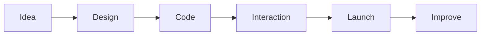

<div align="center">


<br />


<br /><br />
<a href="https://samia-bouhanna-portfolio.vercel.app/">
  
</a>
<a href="https://git.io/typing-svg">
  
</a>

<br />

<a href="https://samia-bouhanna-portfolio.vercel.app/">
  
</a>
<a href="https://www.linkedin.com/in/samia-bouhanna-0b370a224/">
  
</a>
<a href="mailto:samiamin821940@gmail.com">
  
</a>

<br /><br />


</div>

---

## 🌸 About Me


```javascript
const samia = {
  title: "Frontend Developer",
  location: "Algeria 🇩🇿",
  vibe: "Fantasy-anime inspired creator",
  passion: "Building elegant, responsive and interactive interfaces",
  favoriteLanguages: ["Python 🐍", "TypeScript 💙"],
  currentFocus: ["React", "Next.js", "React Native", "AI products"],
  learning: ["Python for AI", "Frontend architecture", "Artificial Intelligence"],
  mission: "Create digital experiences that feel magical, smooth and memorable"
};
```

✨ I’m a passionate frontend developer who loves mixing **clean code**, **beautiful interfaces**, and **alive interaction**.

🌙 I enjoy building websites and applications that feel:
- elegant
- responsive
- immersive
- human
- visually memorable

💌 Reach me anytime at **samiamin821940@gmail.com**

<br clear="right"/>

---

## 🎨 Color Palette

<div align="center">

| Color | Hex | Mood |
|------|------|------|
| Deep Night Blue | `#1E2749` | cinematic base |
| Royal Blue | `#435585` | fantasy depth |
| Sky Aura | `#7D8FD3` | magical softness |
| Lavender Mist | `#C6B6E8` | anime elegance |
| Moonlight White | `#EAF6FF` | clean highlights |
| Golden Light | `#F3D49C` | warm Genshin-style accent |

</div>

---

## ⚔️ My Tech Vision

<div align="center">

### 💫 Favorite Languages


<br /><br />


<br /><br />


<br />


<br /><br />


<br />


<br /><br />


</div>

---

## 🗺️ Featured Projects

<table>
<tr>
<td width="50%" valign="top">

### 🍨 Crèmerie de Ghazaouet
A modern and responsive commerce website with a user-friendly catalogue and a polished visual identity.

**Stack:** React, JavaScript, CSS, Vercel

<a href="https://cremerie-de-ghazaouet-website.vercel.app/">
  
</a>

</td>
<td width="50%" valign="top">

### 🩺 Zaya Digital Clinic
A clean healthcare interface focused on clarity, structure, and a smooth patient-centered experience.

**Stack:** TypeScript, React, Vercel

<a href="https://zaya-clinic-nine.vercel.app/">
  
</a>

</td>
</tr>
<tr>
<td width="50%" valign="top">

### 🏙️ AI Real Estate Platform
An AI-powered real estate product concept that organizes market data and helps users discover better opportunities.

**Stack:** Vue.js, JavaScript, Product Thinking

<a href="https://samia-bouhanna-portfolio.vercel.app/#work">
  
</a>

</td>
<td width="50%" valign="top">

### 🌐 My Portfolio
A cinematic portfolio that presents my skills, selected work, and design vision with a modern personality.

**Stack:** Frontend, Motion, Responsive Design

<a href="https://samia-bouhanna-portfolio.vercel.app/">
  
</a>

</td>
</tr>
</table>

---

## 📜 Developer Journey

<div align="center">



</div>

I love taking a project from the first spark of an idea to a refined product that users can actually enjoy.

---

## 📊 My GitHub Statistics

<div align="center">

<p>
  These cards update from my public GitHub repositories and contributions.
</p>


<br /><br />


<br /><br />


</div>

> **Note:** “Top Languages” is calculated from the code in public repositories.  
> My personal favorite languages are **Python** and **TypeScript**, even when the chart displays other languages first.

---

## ✨ Current Mission

- Build more advanced and polished frontend products
- Strengthen my Python and TypeScript skills
- Build stronger React and Next.js applications
- Learn AI and Python more deeply
- Create useful digital products for real businesses
- Work with international clients and creative teams
- Make interfaces feel more emotional, premium, and alive

---

## 🌠 Fun Facts

- 🎨 I love beautiful UI and cinematic visual style
- ⚡ I enjoy turning complex ideas into clear interfaces
- 🌙 I like dark elegant color systems with magical accents
- 🚀 I’m always growing through new projects and experiments

---

<div align="center">

### “Every interface should feel like a world worth entering.”

<a href="mailto:samiamin821940@gmail.com">
  
</a>

<br /><br />


</div>


